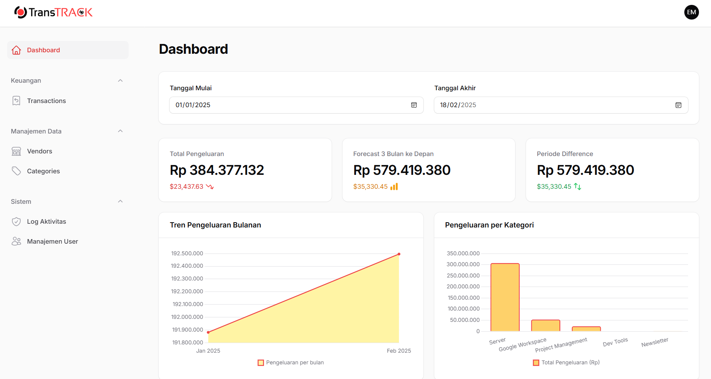

# Dashboard Keuangan V2

Selamat datang di Dashboard Keuangan V2, sebuah aplikasi web yang dirancang untuk membantu memantau dan mengelola transaksi keuangan secara efisien. Aplikasi ini dibangun di atas tumpukan teknologi modern menggunakan Laravel dan Filament, dengan fokus pada fungsionalitas, keamanan, dan pengalaman pengguna yang bersih.



---

## Fitur Utama

Aplikasi ini dilengkapi dengan serangkaian fitur profesional untuk manajemen keuangan yang komprehensif:

#### **1. Dashboard Analitikal & Interaktif**
* **Statistik Utama**: Ringkasan total pengeluaran, forecast 3 bulan, dan jumlah vendor recurring aktif.
* **Grafik Tren**: Visualisasi tren pengeluaran bulanan.
* **Grafik Distribusi**: Analisis pengeluaran berdasarkan kategori (Bar Chart) dan tipe recurring (Doughnut Chart).
* **Grafik Estimasi**: Proyeksi pengeluaran untuk 3 bulan ke depan berdasarkan data recurring.
* **Filter Global**: Kemampuan untuk memfilter seluruh data di dashboard berdasarkan rentang tanggal.

#### **2. Manajemen Transaksi (CRUD Lanjutan)**
* Penambahan, pengeditan, dan penghapusan data transaksi.
* **Penomoran Otomatis**: Setiap transaksi baru akan mendapatkan nomor unik berdasarkan tanggal (e.g., `TRX-20250623-0001`).
* **Form Interaktif**: Konversi mata uang otomatis antara IDR dan USD saat input data.
* **Status Pelunasan**: Kemampuan untuk menandai transaksi sebagai "Lunas" atau "Belum Lunas" langsung dari tabel.
* **Filter Canggih**: Filter tabel berdasarkan rentang tanggal, kategori, vendor, dan status pelunasan.

#### **3. Sistem Multi-Peran & Panel Terpisah**
* **Dua Panel Terpisah**:
    * **Panel Admin (`/admin`)**: Akses penuh untuk mengelola semua data dan pengaturan.
* **Sistem Peran (Role)**: Hak akses dibedakan antara `admin` dan `user`.
* **Login Terpusat & Pengalihan Otomatis**: Satu halaman login yang akan mengarahkan pengguna ke panel yang sesuai dengan perannya.

#### **4. Sistem Otomatis & Keamanan**
* **Generator Tagihan Berulang**: Sebuah *Scheduled Command* (`transactions:create-recurring`) yang berjalan otomatis setiap hari untuk membuat transaksi recurring yang jatuh tempo, termasuk mekanisme *catch-up* untuk pembayaran yang terlewat.
* **Log Aktivitas (Audit Trail)**: Semua aktivitas pembuatan, pengubahan, dan penghapusan transaksi dicatat secara otomatis dan hanya bisa dilihat oleh admin.
* **Manajemen User**: Admin dapat membuat dan mengelola akun pengguna lain dari dalam panel.

---

## Teknologi yang Digunakan

* **Framework**: Laravel 10 / 11
* **Admin Panel**: Filament 3.x
* **Bahasa**: PHP 8.1+
* **Database**: MySQL / MariaDB
* **Package Tambahan**:
    * `spatie/laravel-activitylog`: Untuk fitur Log Aktivitas.
    * `malzariey/filament-daterangepicker-filter`: Untuk filter rentang tanggal di tabel.

---

## Instalasi & Setup

Berikut adalah cara untuk menjalankan proyek ini di lingkungan lokal.

1.  **Clone Repositori**
    ```bash
    git clone [URL-repositori-anda]
    cd [nama-folder-proyek]
    ```

2.  **Install Dependensi**
    ```bash
    composer install
    composer require malzariey/filament-daterangepicker-filter
    ```

3.  **Setup File `.env`**
    ```bash
    cp .env.example .env
    ```
    Buka file `.env` dan sesuaikan konfigurasi database (`DB_DATABASE`, `DB_USERNAME`, `DB_PASSWORD`).

4.  **Generate Application Key**
    ```bash
    php artisan key:generate
    ```

5.  **Jalankan Migrasi Database**
    Perintah ini akan membuat semua tabel yang dibutuhkan.
    ```bash
    php artisan migrate
    ```

6.  **(Opsional) Buat Akun Admin Awal**
    Jalankan `php artisan tinker` dan buat user admin:
    ```php
    User::create([
        'name' => 'Admin',
        'email' => 'admin@app.com',
        'password' => bcrypt('password'),
        'role' => 'admin'
    ]);
    ```

7.  **Jalankan Server Development**
    ```bash
    php artisan serve
    ```
    Aplikasi sekarang bisa diakses di `http://127.0.0.1:8000`.

---

## Cara Menggunakan Aplikasi

Aplikasi ini memiliki dua jenis pengguna dengan akses yang berbeda.

#### **Akun Admin**
* **Login**: Gunakan kredensial admin yang sudah dibuat (e.g., `admin@app.com` | `password`).
* **URL Akses**: `http://127.0.0.1:8000/admin`
* **Fitur**: Admin dapat mengakses semua fitur yang disebutkan di atas, termasuk membuat user baru, melihat log aktivitas, dan mengelola semua data keuangan.

#### **Akun User**
* **Login**: Gunakan kredensial user biasa (dibuat oleh admin).
* **URL Akses**: `http://127.0.0.1:8000/app`
* **Fitur**: Setelah login, user akan otomatis diarahkan ke `/app` dan hanya dapat melihat halaman dashboard tanpa bisa mengubah atau mengakses data lain.

#### **Menjalankan Fitur Otomatis**
Untuk menguji fitur pembuatan transaksi berulang secara manual, jalankan perintah ini di terminal:
```bash
php artisan transactions:create-recurring